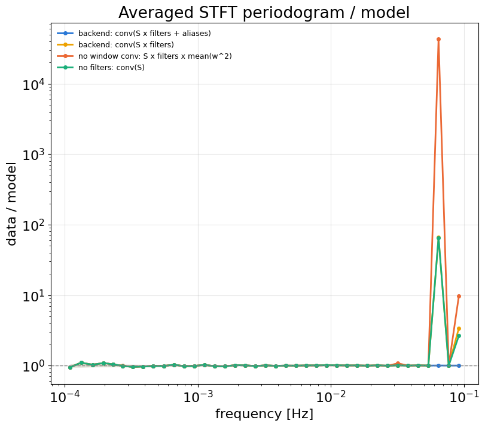
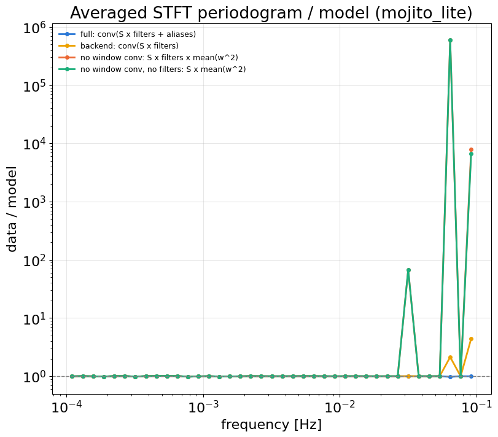

# Noise model after preprocessing: filters, window, and downsampling aliases

The preprocessing changes the noise in the data. The following steps all act on it:

- highpass and lowpass `sosfiltfilt`;
- `resample_poly` decimation by D;
- the Tukey window of the STFT.

The noise covariance has to apply the same operations to the instrument PSD $S(f)$:

$$
C(f) \;=\; \big|\tilde w\big|^2 \circledast \Big[\, |H(f)|^2\, S(f) \;+\; \sum_{a} |H(|f_a|)|^2\, S(f_a) \Big],
\qquad f_a \in \{-(k f_s' - f),\; k f_s' + f\}
$$

`9a7e8729` and `39b70769` added the first term and the convolution. `8824aad7` adds the sum over aliases.

| Change | Commits | Term | What it accounts for in the data |
|---|---|---|---|
| Filter response | `9a7e8729`, `39b70769` (A. Santini, F. Pozzoli) | $\lvert H(f)\rvert^2 S(f)$ | In-band attenuation from the IIR filters ($\lvert H\rvert^4$ for zero-phase) and the FIR. The effect is largest near the top of the band: the response is **0.25 at 0.1 Hz** (lowpass at 0.16 Hz, order 2). |
| Window convolution | `9a7e8729`, `39b70769`; rfft/batched in `2b7d39f1` | $\lvert\tilde w\rvert^2 \circledast$ | Spectral leakage of the Tukey window, which fills the deep TDI notches (0.03, 0.06, 0.09 Hz) with power from nearby frequencies. |
| Downsampling aliases | `8824aad7` | $\sum_a \lvert H(\lvert f_a\rvert)\rvert^2 S(f_a)$ | Noise between the new and the old Nyquist frequency (0.1–0.2 Hz) folds back into the band at $f_s'-f$. The 41-tap Kaiser(β=5) FIR does not suppress it, and the TDI noise rises steeply there. At 0.1 Hz the alias term is **0.97×** the direct term, so it almost doubles the power. It also fills the notches. |

The alias term is built on an extended frequency grid in C++ (`PSD.cu`), so it uses the same averaged or STFT transfer functions as the main term. For negative $f_a$ the cross-spectra are conjugated. The term is on by default (`alias_correction=True` in `process`). It is not yet supported with the composite backend or with splines.

## Setup

Both tests use the `psd_multigpu_settings.py` preprocessing:

- sampling: 0.4 → 0.2 Hz (D = 2);
- highpass: 5e-6 Hz, order 2;
- lowpass: 0.16 Hz, order 2, zero-phase;
- band: 1e-4 – 0.1 Hz;
- statistic: data/model, where data is the averaged STFT periodogram $2\,\delta f\,\langle|X|^2\rangle$ and $E[\cdot]=C$. A ratio of 1 means the model matches the data.

The two tests differ in their input and segmentation:

- **`window_filter_check.ipynb`:** synthetic Gaussian noise with a known TDI2-like PSD, run through the real `process` and `pour`. Segments are 1 day long; there are 50 segments × 3 channels (150 averages).
- **`gf_dev/noise/dev_filter_response_mojito_lite.ipynb`:** real mojito_lite L1 noise (731 d). Segments are 7 days long with a 1200 s taper; there are ~101 segments × 3 channels.

## Results

### Synthetic noise, data/model, top of the band

The bins are 0.01 Hz wide. The expected 1σ per bin is 0.003.

| Band [Hz] | **Full model** | Filters + window only (before `8824aad7`) | Aliases, but no in-band $\lvert H\rvert^2$ |
|---|---|---|---|
| 0.05–0.06 (notch) | **0.999** | 68.6 | 0.998 |
| 0.06–0.07 | **1.000** | 6.96 | 1.000 |
| 0.07–0.08 | **1.001** | 1.001 | 0.996 |
| 0.08–0.09 (notch) | **0.997** | 4.23 | 0.964 |
| 0.09–0.10 | **1.000** | 1.65 | 0.631 |
| mean, 1e-4–0.05 | **1.001** | 1.001 | 1.002 |

- Leaving out the aliases makes the model too low near the Nyquist frequency and in the notches.
- Leaving out the in-band filter makes the model too high at the band edge: the ratio is 0.63 at 0.09–0.1 Hz.
- Below 0.05 Hz all variants agree. The first log bin (1e-4–2e-4 Hz) is at 1.034, which is 1.2σ for its 8 bins.

### mojito_lite, data/model

The bins are log-spaced. The formal 1σ is ≲1e-3, but it is a lower bound because X, Y and Z are correlated.

| Band [Hz] | **Full model** | Filters + window | No window conv. | No window conv., no filters |
|---|---|---|---|---|
| 1e-4 – 2.85e-2 (9 bins) | **0.996 – 1.006** | 0.996 – 1.006 | 0.996 – 1.007 | 0.996 – 1.007 |
| 2.85e-2 – 5.34e-2 | **1.001** | 1.001 | 16.0 | 16.0 |
| 5.34e-2 – 1.0e-1 | **0.994** | 2.47 | 1.5e5 | 1.5e5 |

- The window convolution is needed at the 0.03 Hz notch: without it the ratio is 16, with it 1.001.
- The alias term is needed above 0.05 Hz: without it the ratio is 2.47, with it 0.994. In the finer bins of the plot, the filters-only ratio reaches about 2 at 0.065 Hz and about 4.5 at 0.09 Hz.

### Code-level checks

| Check | Result |
|---|---|
| C++ alias covariance vs NumPy reference, FD-averaged TFs | max rel. err 6e-12 (auto), 8e-13 (cross) |
| Same, STFT TFs | 0.0 |
| Same, without conjugating the $f_a<0$ cross terms | rel. err 1.8 / 2.1, so the conjugation is required |
| Window convolution, current rfft/batched vs `39b70769` two-sided FFT | max per-bin difference 3.0e-6 ([plot](figs_filter_response/synthetic_39b7076_vs_current.png)) |

## References

1. A. V. Oppenheim, R. W. Schafer, *Discrete-Time Signal Processing*, 3rd ed., §4.6, Prentice Hall (2010). Covers decimation and the folding of $|f| > f_s'/2$ into the band.
2. D. B. Percival, A. T. Walden, *Spectral Analysis for Physical Applications*, §6.3–6.4, Cambridge Univ. Press (1993). Shows that the expected tapered periodogram is the PSD convolved with the spectral window.
